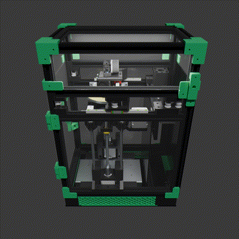
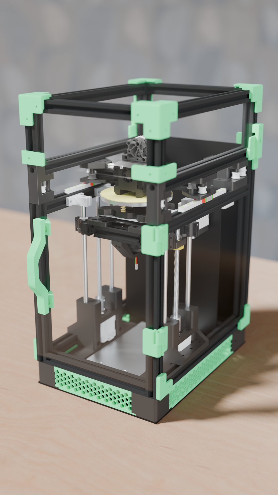
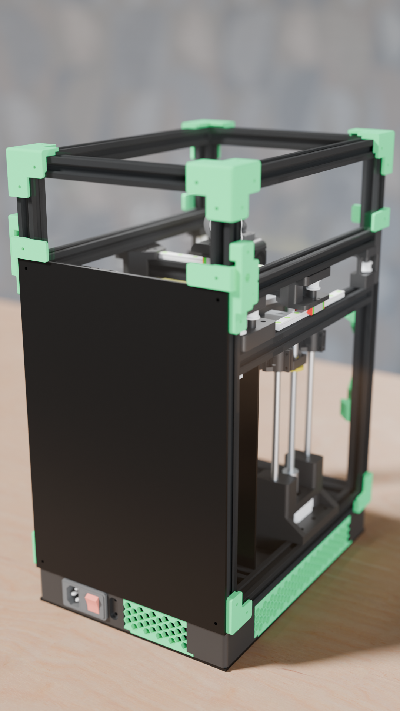

    
    <h1>Moron - The "Non-Euclidean" "V0"</h1>

| [JOURNAL](JOURNAL.md) *(48.5h)* | ~~[BUILDING JOURNAL](JOURNAL_BUILDING.md)~~ | [BOM](BOM.csv) |
|---------------------------------|---------------------------------------------|----------------|

# Introduction

Hello! I'm May, and you're witnessing the best creation known to man. I don't know how I'm getting a grant for this, but free printer money is free printer money.

> firmware would be an absolute mess 
> \- Anicetus 2026

The Moron is a Polar-CoreXY hybrid printer that looks like a V0. I call it "non-euclidean" because I plan to use the polar bed for arc moves -- therefore the best distance between two points is not a straight line.

I wanted something silly that could print ASA and mess around with. Sporting a 120mm polar bed and a 120x120x120 volume, what is there to not like? I haven't written the kinematics yet in software (famous last words -- and I kind of need the printer to do that lol), but right now I bet you could get some really cool timelapses!

My aim for the project is to design a very... odd, printer haha. I also need an enclosed printer for ASA among other things, so this would be a very big help for future projects!

If you want to build one: *don't*. But if you're redbigz you can find all the subtractive cuts/heater files in `cad/cuts/` and `cad/pcb/` and the CAD link [here](https://cad.onshape.com/documents/feabf94b86e21fadd98f4223/w/96543d883315d41072e87b21/e/ef18f69e66a19900010b1f70) (oh also the final STEP is in `cad/`!). 

# Render Gallery

